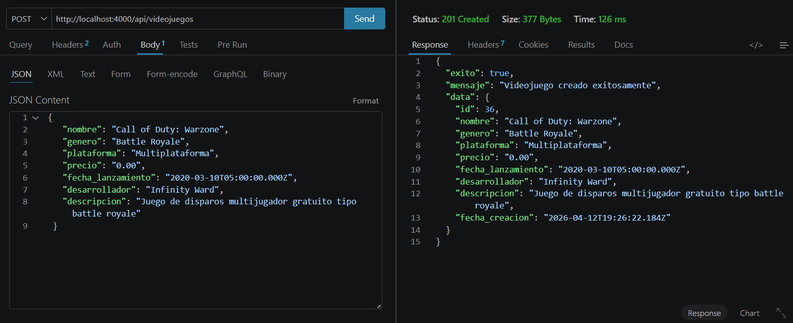

# Aplicación con Supabase

Se ejecuta con npm run dev


# 🎮 API Videojuegos - Node.js + PostgreSQL

## 📌 Descripción

Este proyecto es una API REST desarrollada con Node.js y Express que permite gestionar un catálogo de videojuegos mediante operaciones CRUD (Crear, Leer, Actualizar y Eliminar).

Está diseñada como material de aprendizaje para comprender:

* Arquitectura backend
* Conexión a base de datos
* Manejo de rutas REST
* Separación de responsabilidades (MVC básico)

---

## 🏗️ Estructura del Proyecto

```
/configuracion
  └─ baseDatos.js      → Configuración de conexión a la BD

/controladores
  └─ videojuegoscontrolador.js → Lógica del negocio (CRUD)

/node_modules

.env                  → Variables de entorno
formato.html         → Plantilla base (no usada directamente)
package.json
README.md
servidor.js          → Punto de entrada del servidor
```

---

## ⚙️ Tecnologías utilizadas

* Node.js
* Express
* PostgreSQL
* dotenv
* cors

---

## 🔌 Configuración de la base de datos

Archivo `.env`:

```
DB_HOST=localhost
DB_PORT=5432
DB_NAME=videojuegos_db
DB_USER=postgres
DB_PASSWORD=tu_password
PORT=4000
```

---

## 🗄️ Modelo de datos

Tabla: `videojuegos`

| Campo             | Tipo    |
| ----------------- | ------- |
| id                | SERIAL  |
| nombre            | VARCHAR |
| genero            | VARCHAR |
| plataforma        | VARCHAR |
| precio            | NUMERIC |
| fecha_lanzamiento | DATE    |
| desarrollador     | VARCHAR |
| descripcion       | TEXT    |

---

## 🚀 Ejecución del proyecto

```bash
npm install
npm run dev
```

Servidor disponible en:

```
http://localhost:4000
```

---

## 🔄 Endpoints

### 📥 Obtener todos los videojuegos

```
GET /api/videojuegos
```

---

### 🔍 Obtener videojuego por ID

```
GET /api/videojuegos/:id
```

---

### ➕ Crear videojuego

```
POST /api/videojuegos
```

Body JSON:

```json
{
  "nombre": "God of War",
  "genero": "Acción",
  "plataforma": "PS5",
  "precio": 59.99
}
```

---

### ✏️ Actualizar videojuego

```
PUT /api/videojuegos/:id
```

---

### ❌ Eliminar videojuego

```
DELETE /api/videojuegos/:id
```

---

## 🧠 Arquitectura del sistema

El proyecto sigue una arquitectura modular básica:

### 1. Servidor (`servidor.js`)

* Configura Express
* Define rutas
* Inicia el servidor

### 2. Controladores

* Contienen la lógica de negocio
* Interactúan con la base de datos

### 3. Configuración de BD

* Maneja la conexión usando Pool
* Centraliza credenciales

---

## 🔄 Flujo de una petición

1. Cliente hace request (ej: GET /api/videojuegos)
2. Express recibe la ruta
3. Se ejecuta el controlador
4. El controlador consulta la BD
5. Se devuelve respuesta JSON

---

## 📊 Ejemplo de respuesta

```json
{
  "exito": true,
  "mensaje": "Videojuegos obtenidos exitosamente",
  "data": [],
  "total": 0
}
```

---

## 🧪 Pruebas

Puedes usar:

* Postman
* Thunder Client
* Navegador (GET)

---

## 📈 Posibles mejoras

* Autenticación JWT
* Paginación
* Subida de imágenes
* Validaciones con Joi o Zod
* Migrar a arquitectura MVC completa

---

## 🎯 Objetivo educativo

Este proyecto permite entender:

* Cómo funciona una API REST
* Cómo conectar Node con una base de datos
* Cómo estructurar un backend profesional
* Buenas prácticas básicas de desarrollo

---

## 👨‍💻 Autor

Proyecto desarrollado con fines educativos.

Ejemplo de uso de thunder client



[
  {
    "nombre": "Mario Kart 8 Deluxe",
    "genero": "Carreras",
    "plataforma": "Nintendo Switch",
    "precio": "49.99",
    "fecha_lanzamiento": "2017-11-18T05:00:00.000Z",
    "desarrollador": "Nintendo",
    "descripcion": "Juego de carreras con personajes de Nintendo"
  },
  {
    "nombre": "The Legend of Zelda: Breath of the Wild",
    "genero": "Aventura",
    "plataforma": "Nintendo Switch",
    "precio": "59.99",
    "fecha_lanzamiento": "2017-03-03T05:00:00.000Z",
    "desarrollador": "Nintendo",
    "descripcion": "Exploración de mundo abierto en el reino de Hyrule"
  },
  {
    "nombre": "God of War",
    "genero": "Acción",
    "plataforma": "PS4",
    "precio": "39.99",
    "fecha_lanzamiento": "2018-04-20T05:00:00.000Z",
    "desarrollador": "Santa Monica Studio",
    "descripcion": "Historia de Kratos en la mitología nórdica"
  },
  {
    "nombre": "Halo Infinite",
    "genero": "Shooter",
    "plataforma": "Xbox Series X",
    "precio": "59.99",
    "fecha_lanzamiento": "2021-12-08T05:00:00.000Z",
    "desarrollador": "343 Industries",
    "descripcion": "Juego de disparos en primera persona de ciencia ficción"
  },
  {
    "nombre": "FIFA 23",
    "genero": "Deportes",
    "plataforma": "Multiplataforma",
    "precio": "59.99",
    "fecha_lanzamiento": "2022-09-30T05:00:00.000Z",
    "desarrollador": "EA Sports",
    "descripcion": "Simulador de fútbol con licencias oficiales"
  },
  {
    "nombre": "Minecraft",
    "genero": "Sandbox",
    "plataforma": "Multiplataforma",
    "precio": "26.95",
    "fecha_lanzamiento": "2011-11-18T05:00:00.000Z",
    "desarrollador": "Mojang",
    "descripcion": "Juego de construcción y exploración con bloques"
  },
  {
    "nombre": "Cyberpunk 2077",
    "genero": "RPG",
    "plataforma": "PC",
    "precio": "49.99",
    "fecha_lanzamiento": "2020-12-10T05:00:00.000Z",
    "desarrollador": "CD Projekt Red",
    "descripcion": "Juego de rol futurista en un mundo abierto"
  },
  {
    "nombre": "Call of Duty: Warzone",
    "genero": "Battle Royale",
    "plataforma": "Multiplataforma",
    "precio": "0.00",
    "fecha_lanzamiento": "2020-03-10T05:00:00.000Z",
    "desarrollador": "Infinity Ward",
    "descripcion": "Juego de disparos multijugador gratuito tipo battle royale"
  },
  {
    "nombre": "Red Dead Redemption 2",
    "genero": "Aventura",
    "plataforma": "PS4",
    "precio": "59.99",
    "fecha_lanzamiento": "2018-10-26T05:00:00.000Z",
    "desarrollador": "Rockstar Games",
    "descripcion": "Historia del viejo oeste con mundo abierto detallado"
  },
  {
    "nombre": "The Witcher 3: Wild Hunt",
    "genero": "RPG",
    "plataforma": "PC",
    "precio": "39.99",
    "fecha_lanzamiento": "2015-05-19T05:00:00.000Z",
    "desarrollador": "CD Projekt Red",
    "descripcion": "Aventura de rol basada en la historia de Geralt de Rivia"
  }
]

## Ejemplo de Script

⚙️ Agregar script en package.json
"scripts": {
  "insert": "node scripts/insertarVideojuegos.js"
}

## ▶️ Ejecutar

npm run insert

🧠 ¿Qué hace este script?

✔ Inserta los 10 registros en una sola consulta (más rápido)
✔ Devuelve los datos insertados (RETURNING *)
✔ Muestra resultado en consola (console.table)
✔ Cierra conexión correctamente

## ✅ 6. Script de base de datos (IMPORTANTE)

-- Database: api-videojuegos

-- DROP DATABASE IF EXISTS "api-videojuegos";

CREATE DATABASE "api-videojuegos"
    WITH
    OWNER = postgres
    ENCODING = 'UTF8'
    LC_COLLATE = 'Spanish_Colombia.1252'
    LC_CTYPE = 'Spanish_Colombia.1252'
    LOCALE_PROVIDER = 'libc'
    TABLESPACE = pg_default
    CONNECTION LIMIT = -1
    IS_TEMPLATE = False;

Debes tener esta tabla en PostgreSQL:

CREATE TABLE videojuegos (
    id SERIAL PRIMARY KEY,
    nombre VARCHAR(100) NOT NULL,
    genero VARCHAR(50) NOT NULL,
    plataforma VARCHAR(50) NOT NULL,
    precio NUMERIC(10,2) NOT NULL,
    fecha_lanzamiento DATE,
    desarrollador VARCHAR(100),
    descripcion TEXT
);

ALTER TABLE videojuegos ADD CONSTRAINT unique_nombre UNIQUE (nombre);

Tener en cuenta en el insert del Script
ON CONFLICT (nombre) DO NOTHING